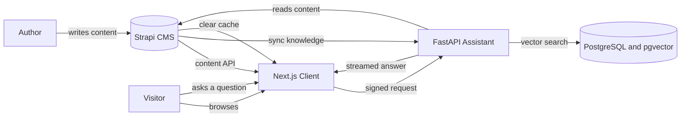

# Portfolio Website


A personal portfolio website that is driven entirely by a headless CMS, with an AI assistant that answers questions about the profile.

Every page, section and block on the website is stored as content in Strapi. Nothing about the layout is hard coded, so a new section can be added from the admin panel without touching the frontend. The same content is also indexed into a vector database, which lets the chat assistant answer questions from the real profile data instead of guessing.

## What is inside

| Service | Folder | Port | Description |
| --- | --- | --- | --- |
| Client | `client/` | 3000 | Next.js website that renders pages from CMS content and hosts the chat panel |
| CMS | `cms/` | 1337 | Strapi admin and content API, plus a custom plugin for sync and cache control |
| Assistant | `assistant/` | 8000 | FastAPI service that indexes the content and streams AI answers |
| Database | PostgreSQL | 5432 | Stores the CMS content and the vector embeddings |

## How it works



There are three flows worth understanding.

**Rendering a page.** The client asks Strapi for a page by its slug. Strapi returns a list of blocks. The client looks up each block in a registry and renders the matching React component. The result is cached, so repeat visits do not hit the CMS again.

**Indexing the knowledge.** An author presses a button in the Strapi admin panel. Strapi calls the assistant with a signed request. The assistant pulls the resume, the articles and the custom notes from Strapi, splits them into chunks, hashes every chunk and sends only the changed ones to the embedding model. The vectors are stored in PostgreSQL.

**Answering a question.** A visitor types a question into the chat panel. The client signs the request and forwards it to the assistant. A planner model decides whether the question can be answered directly or needs data. If it needs data, the assistant reads the relevant Strapi collections and runs a vector search at the same time, builds a context document from both, and streams the answer back word by word.

## Documentation

Detailed guides live in the [docs](docs/README.md) folder.

- [Client](docs/CLIENT.md) covers dynamic rendering, the registries and the build.
- [CMS](docs/CMS.md) covers the content model and the custom plugin.
- [Assistant](docs/ASSISTANT.md) covers authentication, sync and the chat chain.

## Getting started

### Prerequisites

- Node.js 22 or newer
- Yarn
- Python 3.12 or newer with [uv](https://docs.astral.sh/uv/)
- Docker Desktop, if you want to run everything in containers
- PostgreSQL 18 with the `pgvector` extension, if you run without Docker

### Environment files

Every service ships an example file. Copy it and fill in the values.

```bash
cp assistant/.env.example assistant/.env
cp client/.env.example client/.env
cp cms/.env.example cms/.env
```

Three values have to match across the services, otherwise the requests between them are rejected.

| Value | Set in | Purpose |
| --- | --- | --- |
| `CLIENT_SECRET` and `ASSISTANT_SECRET` | assistant, client, cms | Shared secret used to sign every request sent to the assistant |
| `REVALIDATE_SECRET` | client, cms | Lets the CMS clear the website cache |
| `API_TOKEN` | client | Strapi read only API token, created in the Strapi admin panel |

### Run with Docker Compose

The compose files live in the `docker-compose/` folder.

| File | Purpose |
| --- | --- |
| `docker-compose/docker-compose.development.yaml` | PostgreSQL, pgAdmin, MinIO and Papercut, the services you need while running the applications from the command line |
| `docker-compose/docker-compose.local.yaml` | The same supporting services through `include`, plus the three applications built from their production Dockerfiles |

`docker-compose.local.yaml` runs the real production images. The CMS runs `strapi start`, the assistant runs Uvicorn with four workers, and the client serves the standalone Next.js build. Nothing is mounted from your working copy, so what you get locally is what you get in production.

### Filling in the values

The compose file declares every environment variable inside itself, so it does not read the `.env` files at all. Most values are already correct for a local run. The ones below are placeholders, so open `docker-compose/docker-compose.local.yaml` and replace them before the first start.

| Service | Variable | Placeholder | What to put there |
| --- | --- | --- | --- |
| client | `API_TOKEN` | `api_token` | A Strapi read only API token, created under Settings, API Tokens |
| assistant | `STRAPI_AUTH_TOKEN` | `token` | The same Strapi API token |
| assistant | `GEMINI_API_KEY` | `api_key` | Your key, if the LLMSetting single type selects Gemini |
| assistant | `AZURE_OPENAI_API_KEY` | `api_key` | Your key, if it selects Azure OpenAI |
| assistant | `MISTRAL_API_KEY`, `OPENAI_API_KEY` | `api_key` | Only if you select those connectors |
| client | `GITHUB_TOKEN` | `token` | Optional, raises the rate limit for the contribution calendar |
| cms | `AWS_ACCESS_KEY_ID`, `AWS_ACCESS_SECRET` | `keyid`, `your-aws-secret` | Credentials for MinIO or whichever S3 storage you use |

The Strapi secrets in the `cms` service, `APP_KEYS` through `ENCRYPTION_KEY`, are left as `tobemodified`. They work for a local run, but generate real values before using this anywhere else.

`API_TOKEN` is needed in two separate places, and they are filled in two different ways.

| Where | How it is supplied |
| --- | --- |
| The running client container | The `API_TOKEN` value in the client service, edited in the file |
| The client image build | The top level `secrets` block, which reads the `API_TOKEN` variable from your shell |

The second one is easy to miss. The `secrets` block says `environment: API_TOKEN`, which means Docker Compose looks at the environment of the terminal you run the command in, not at anything inside the file. Editing the file alone leaves the build secret empty, Strapi answers the build with a 401, and the client build fails. So export it before building.

```bash
export API_TOKEN=...
```


Two more values have to stay identical wherever they appear, otherwise the services reject each other.

| Value | Appears as |
| --- | --- |
| `dummy-client-secret` | `ASSISTANT_SECRET` in the cms and client services, `CLIENT_SECRET` in the assistant service |
| `adnhfasdfwer2w2dfs` | `REVALIDATE_SECRET` in both the cms and client services |


### Starting it up

Because these are production images, the client is compiled during its build, and Next.js reads the CMS while compiling. Strapi therefore has to be running before the client image is built. Docker Compose cannot express that on its own, because `depends_on` orders containers at start up and has no effect on the build step, so the start up runs in two parts.

**1. Bring up the CMS and wait for it**

```bash
docker compose -f docker-compose/docker-compose.local.yaml up -d --build --wait postgres-db cms
```

`--wait` holds the command until the health check built into the CMS image passes, so when it returns Strapi is accepting requests. There is nothing to watch and nothing to time.

On the very first run Strapi has no content and no tokens. Open http://localhost:1337/admin, create the admin account, then create a read only API token and put it into the compose file as described above.

**2. Build and start the rest**

```bash
docker compose -f docker-compose/docker-compose.local.yaml up -d --build
```

The client image is built at this point, while Strapi is running. The `BASE_URL` build argument has to be an address the build container itself can reach. A build container has its own network, so `localhost` there means the build container, not your machine. On Docker Desktop the working value is `http://host.docker.internal:1337/api`, paired with an `extra_hosts` entry mapping `host.docker.internal` to `host-gateway`.

Once the client image exists, the assistant and the client start.

After the first time, the images already exist, so a plain start is enough.

```bash
docker compose -f docker-compose/docker-compose.local.yaml up -d
```

Rebuild the client whenever the content that gets pre rendered changes.

```bash
docker compose -f docker-compose/docker-compose.local.yaml up -d --build client
```

### Addresses

| Address | Service |
| --- | --- |
| http://localhost:3000 | Website |
| http://localhost:1337/admin | Strapi admin panel |
| http://localhost:8081 | pgAdmin |
| http://localhost:9001 | MinIO console, media storage |
| http://localhost:8500 | Papercut, catches outgoing email |

The assistant runs on port 8000. Its API docs are switched off, because `docker-compose.local.yaml` sets `ENVIRONMENT` to `production` to match a real deployment. Change that value to `development` if you want http://localhost:8000/docs while working locally.

The first run takes several minutes because three images are built and the database extension is installed. On the very first start Strapi has no content, so create an admin account, add some content, and then press **Sync AI knowledge** in the Portfolio plugin.

To stop everything, run the command below.

```bash
docker compose -f docker-compose/docker-compose.local.yaml down
```

### Run from the command line

Use this when you want the fastest reload while developing. Start the supporting services first, then run each application in its own terminal.

**1. Start the database and the helpers**

```bash
docker compose -f docker-compose/docker-compose.development.yaml up -d
```

If you already have PostgreSQL 18 with the `pgvector` extension, skip this step and point the connection strings at your own instance.

**2. Start the CMS**

```bash
cd cms
yarn install
yarn develop
```

Strapi starts on http://localhost:1337. Create the admin account on the first run, then open **Settings**, **API Tokens** and create a read only token. Put that token into `client/.env` as `API_TOKEN`.

**3. Start the assistant**

```bash
cd assistant
uv sync
uv run uvicorn app:app --reload --port 8000
```

The assistant starts on http://localhost:8000 and creates its tables on the first run. It reads the model configuration from Strapi at startup, so the CMS has to be running already.

**4. Start the client**

```bash
cd client
yarn install
yarn dev
```

The website starts on http://localhost:3000.

The order matters. The assistant reads its model settings from Strapi when it starts, and the client reads its content from Strapi on every request, so always start the CMS first.

## Media storage

Uploads are handled by the Strapi S3 provider, which works with Amazon S3 and with any S3 compatible storage. Configure it through the `AWS_ACCESS_KEY_ID`, `AWS_ACCESS_SECRET`, `AWS_BUCKET`, `AWS_REGION` and `AWS_ENDPOINT` variables in `cms/.env`.
