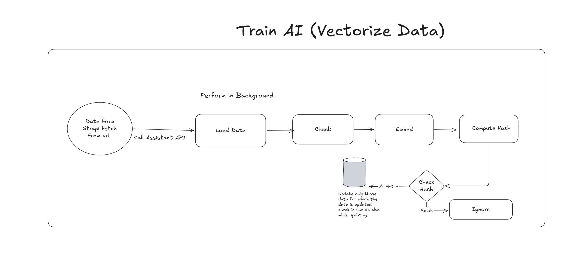
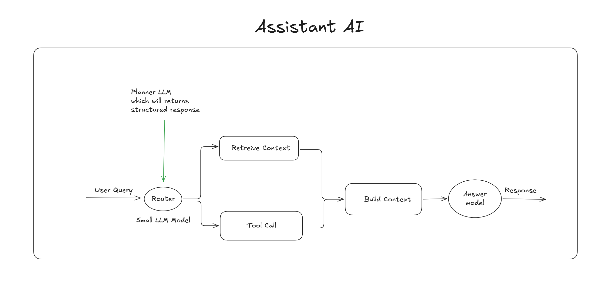

# Portfolio Website Assistant

These Assistant would only know about me or the project i m creating. We already have the structured data from the Strapi and We will vectorize the data from Resume and blog articles as the training.

### Technology Stack:

- Langchain
- Python
- UV (Package Manager)
- Vector Database (Existing PgVector)
- Embedding Generator

## Training the Data or Vectorizing the Data

Below Screenshot shows how the vectorizing the data would be from the strapi only


- Need to Create the **AIKnowledge** as the Collection Type in the Strapi which would contains the below fields
  - `Title`
  - `Media` (All Types)
  - `SourceType` (Enumeration) -> ["Blog","Resume","Custom,"FAQ"]
  - `Content` (Rich Text)
- One Single Collection Type **LLMSettings**
  - `PlannerSystemPrompt` - Rich text editor
  - `AnswerSystemPrompt` - Rich text editor
  - `ModelAPIKey` - text
  - `ModelConnector` - Enumeration (Openai,Gemini,Mistral)
  - `ModelBaseUrl` - text
  - `Temperature` - Decimal

## Answer

Below screenshot is the flowchart how AI will respond for the asked question



- Firstly it will go to the Planner LLM which must be small LLM model which will decide what response to give like where to search for these question whether it should see the structured data or search.
- It will give the response like the below the JSON.
  ```json
  {
    "structured": [
      {
        "source": "",
        "filters": []
      }
    ],
    "semantic": {
      "enabled": false,
      "query": ""
    }
  }
  ```
- After Getting the response from the planner model then it will call these tools parallel then return to build the context
- The Response or Answer model will respond for the context gathered. 

### Restrictions
- The API Call must be only from the next js
- Add the Rate Limit like in one minute only 2 Response per user
- The Train API also add the rate limit only one day one training.
