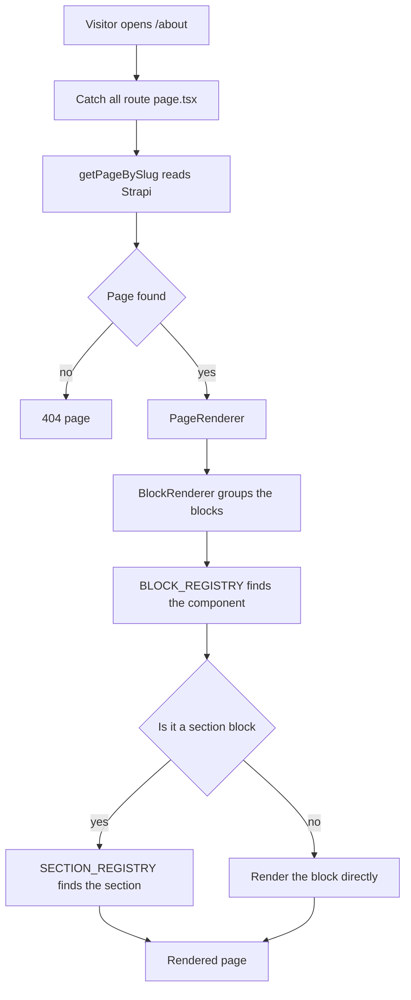

# Client

The client is a [Next.js](https://nextjs.org/) 16 application using the App Router, React 19 and Tailwind CSS 4. It renders the whole website from content stored in Strapi.

The important idea is that there are no hard coded pages. A page is a list of blocks in the CMS, and the client knows how to turn each kind of block into a React component.

## Folder layout

```
client/
  src/app/            routes, layouts and API route handlers
  features/           one folder per feature, each with its own service and components
  components/ui/      small shared UI primitives
  lib/                environment reading, SEO helpers, request signing
  types/              TypeScript types for the CMS content
```

Each feature folder owns its data. For example `features/blog/` contains `service.ts`, which fetches blogs from Strapi, and `components/`, which renders them. Nothing outside the folder reaches into it.

## How a page is generated



Walking through it in words.

1. A visitor opens a URL. The catch all route `src/app/[...slug]/page.tsx` receives the slug.
2. `getPageBySlug` asks Strapi for a page with that slug and returns it, or `null`.
3. `PageRenderer` writes the structured data for SEO and hands the block list to `BlockRenderer`.
4. `BlockRenderer` groups the blocks, then looks up each group in the block registry.
5. Some blocks are sections. Those go through a second lookup in the section registry.

## The three registries

A registry is a plain object that maps a name coming from the CMS to a React component. This is what makes the site dynamic. Adding a new kind of block is two steps: create the component, then add one line to the registry.

### Block registry

`features/page/components/block-registry.ts`

Strapi sends every block with a `__component` field such as `shared.hero` or `section.skills`. The block registry maps that string to a component.

```ts
export const BLOCK_REGISTRY: BlockRegistry = {
  "shared.hero": HeroBlock,
  "shared.next": NextBlock,
  "shared.links": LinkBlock,
  "home.social-links": SocialLinksBlock,
  "section.skills": SectionBlock,
  "section.contact-form": ContactFormBlock,
  "section.resume": ResumeDownload,
};
```

The type is not a loose `Record<string, ComponentType>`. It is built from the union of block types, so each component only receives the block shape it actually handles.

```ts
type BlockOf<K extends PageBlockName> = Extract<PageBlock, { __component: K }>;

export type BlockRegistry = {
  [K in PageBlockName]?: ComponentType<{ blocks: BlockOf<K>[]; searchParams?: SearchParams }>;
};
```

If a block arrives that is not in the registry, `BlockRenderer` renders nothing for it instead of crashing.

### Section registry

`features/page/components/section-registry.ts`

A section is a block that pulls in a whole collection, for example every skill or every project. In the CMS these all share one component, `section.skills`, and a `Type` field decides which collection to show. The section registry maps that `Type` to the component.

```ts
export const SECTION_REGISTRY: Partial<Record<SectionType, SectionComponent>> = {
  Skills: SkillsSection,
  Timeline: createTimelineSection("Timeline"),
  Experience: createTimelineSection("Experience"),
  Educations: createTimelineSection("Educations"),
  Projects: ProjectsSection,
  Certifications: CertificationsSection,
  Blogs: BlogsSection,
};
```

Three of these entries come from `createTimelineSection`, a factory that returns a section component bound to one timeline kind. Timeline, Experience and Educations look the same and differ only in the data they read, so one factory covers all three.

`SectionBlock` performs the lookup.

```tsx
export function SectionBlock({ blocks, searchParams }: SectionBlockProps) {
  const section = blocks[0];
  if (!section) return null;

  const Component = SECTION_REGISTRY[section.Type];
  if (!Component) return null;

  return <Component section={section} searchParams={searchParams} />;
}
```

### Icon registry

`features/shared/components/icon-registry.ts`

Content authors pick an icon by typing its name, for example `SiPython` or `SiDocker`. The client cannot import icons dynamically by name, so every icon that authors are allowed to use is imported once and collected into a map.

```ts
export const ICON_REGISTRY: Record<string, IconType> = {
  SiPython, SiDocker, SiReact, SiNextdotjs, /* and the rest */
};
```

There is a second, smaller map for social links, keyed by platform name rather than icon name.

```ts
export const PLATFORM_ICON: Record<string, IconType> = {
  github: SiGithub,
  linkedin: FaLinkedinIn,
  email: FaEnvelope,
  website: FaGlobe,
};
```

The `Icon` component tries the icon name first, then the platform, and falls back to a short text monogram if neither matches. That way a typo in the CMS shows a small label instead of an empty gap.

```tsx
const Resolved = (name && ICON_REGISTRY[name]) || (platform && PLATFORM_ICON[platform]);

if (Resolved) return <Resolved className={className} aria-hidden />;
if (!monogram) return null;
```

## How blocks are grouped

`BlockRenderer` does one thing before rendering. Strapi returns a flat list, but some blocks belong together.

- A `shared.badge` block is a divider. It opens a new section and the block after it belongs to that section.
- Some blocks repeat, such as `home.social-links`. Several of them in a row are one group, not several sections.

`groupBlocks` walks the flat list and produces groups of `{ divider, blocks }`. Each group renders as one `<section>` with a top border. This keeps the visual rhythm of the page consistent no matter what the author arranges in the CMS.

## Caching

Every service function is cached with the Next.js `use cache` directive.

```ts
export async function getPageBySlug(slug: string): Promise<Page | null> {
  "use cache";
  cacheLife("hours");
  cacheTag(CACHE_TAG.pages, `page-${slug}`);
  ...
}
```

`cacheLife("hours")` sets how long the entry stays fresh. `cacheTag` labels the entry so it can be cleared later by name. Tags are listed in `features/shared/service.ts` under `CACHE_TAG`.

When an author publishes something in Strapi, the Portfolio plugin calls `POST /api/revalidate` on the website with the shared secret. The route clears every tag at once.

```ts
const tags = Object.values(CACHE_TAG);
for (const tag of tags) revalidateTag(tag, "max");
```

This is why the site can be aggressively cached and still update immediately after an edit.

## The chat panel

The chat panel lives in `features/ai/`.

- `use-chat.ts` holds the conversation state and reads the response stream.
- `components/ask-ai-panel.tsx` renders the messages, the activity line and the input.
- `src/app/api/chat/route.ts` is the server side proxy.

The browser never talks to the assistant directly, because the shared secret must not reach the browser. The request goes to the Next.js route handler, which signs it and forwards it. The response is a Server Sent Event stream and is passed straight back to the browser without buffering.

```ts
return new Response(upstream.body, {
  headers: {
    "Content-Type": "text/event-stream",
    "Cache-Control": "no-cache, no-transform",
    Connection: "keep-alive",
    "X-Accel-Buffering": "no",
  },
});
```

The route also drops repeated requests. Every message carries a `requestId`, and ids seen in the last hour are held in memory, so a double click does not spend two AI calls.

On the browser side the stream is parsed with the `eventsource-parser` library rather than by hand.

```ts
const reader = response.body
  .pipeThrough(new TextDecoderStream())
  .pipeThrough(new EventSourceParserStream())
  .getReader();
```

## Environment variables

| Name | Required | Purpose |
| --- | --- | --- |
| `BASE_URL` | yes | Strapi content API, for example `http://localhost:1337/api` |
| `API_TOKEN` | yes | Strapi read only API token |
| `ASSISTANT_URL` | yes | Assistant base URL |
| `ASSISTANT_SECRET` | yes | Shared secret used to sign assistant requests |
| `REVALIDATE_SECRET` | yes | Secret the CMS presents when clearing the cache |
| `SITE_URL` | no | Public site URL, used for SEO and the sitemap |
| `MEDIA_URL` | no | Public base URL for uploaded media |
| `GITHUB_TOKEN` | no | Raises the rate limit for the contribution calendar |

Missing required variables throw at startup with a clear message rather than failing later.

## Running and building

```bash
yarn install
yarn dev          # http://localhost:3000
yarn build        # production build
yarn start        # serve the production build
yarn lint
```

### A note about the production build

`next.config.ts` sets `output: "standalone"` so the Docker image only needs the compiled server and its dependencies, which keeps the image small.

The build needs Strapi to be reachable. Two things cause this.

- `generateStaticParams` in `src/app/blog/[slug]/page.tsx` and `src/app/[...slug]/page.tsx` asks Strapi which slugs exist, so those pages can be pre rendered.
- `layout.tsx` calls `getSiteSettings()`, and the layout wraps every pre rendered route.

So `yarn build` and `docker build` both fail if the CMS is down. Point `BASE_URL` at a running CMS when you build.

```bash
docker build -t portfolio-client \
  --build-arg BASE_URL=https://cms.example.com/api \
  --secret id=api_token,env=API_TOKEN \
  ./client
```

This applies to `docker-compose/docker-compose.local.yaml` too, because it runs the production image. Start the CMS first, then build the client, as described in the [main README](../README.md).

Running `yarn dev` locally is different. The development server fetches content per request and pre renders nothing, so the CMS only needs to be up when you load a page, not when you start the server.
