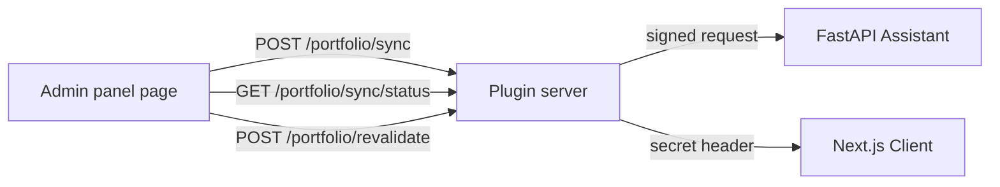

# CMS

The CMS is [Strapi](https://strapi.io/) 5. It stores every piece of content the website shows, the settings the AI assistant uses, and it hosts a custom plugin that connects the other two services.

Strapi runs on port 1337. The admin panel is at http://localhost:1337/admin and the content API is at http://localhost:1337/api.

## Content model

Content is split into collections, which hold many entries, and single types, which hold exactly one entry.

### Collections

| Collection | Purpose |
| --- | --- |
| `pages` | Every page on the site, built from a list of blocks |
| `blogs` | Article metadata such as title, description, cover and skill |
| `blog-contents` | The article body, kept separate so the metadata stays light |
| `skills` and `skill-categories` | Skills grouped into categories |
| `projects` and `project-tags` | Projects and their tags |
| `experiences`, `educations`, `time-lines` | Career history |
| `certifications` | Certificates and badges |
| `contacts` | Messages sent from the contact form |
| `versions` | Changelog entries shown on the changelog page |
| `ai-knowledges` | The sources the assistant is allowed to learn from |

### Single types

| Single type | Purpose |
| --- | --- |
| `site-setting` | Site name, navigation, social links, footer and default SEO |
| `ai-setting` | Chat panel text and behaviour |
| `llm-setting` | Which models to use, the system prompts, and the daily answer cap |

### Pages are lists of blocks

A page does not have a fixed shape. It has a `Content` field that holds an ordered list of components. Each component carries a `__component` name that the client uses to find the right React component.

```
Page "home"
  shared.hero
  shared.badge          divider with left and right text
  section.skills        Type = Skills
  shared.badge
  section.skills        Type = Projects
  home.social-links
```

Notice that `section.skills` is reused. The `Type` field decides which collection it pulls. This is why the client needs two registries, one for block names and one for section types. See [Client](CLIENT.md) for how that lookup works.

### The AIKnowledge collection

This collection controls what the assistant knows. Each entry has a `SourceType` of `Blog`, `Resume`, `Custom` or `FAQ`.

- `Blog` does not use the entry body. It tells the assistant to index every published article from `blog-contents`.
- `Resume` normally carries a PDF in the `Media` field. The assistant extracts the text from it.
- `Custom` and `FAQ` use the `Content` rich text field directly.

Adding an entry here and running a sync is all it takes to teach the assistant something new.

### The LLMSetting single type

This is where the AI behaviour is configured without deploying code.

| Field | Purpose |
| --- | --- |
| `Planner` | The model that decides what data a question needs |
| `Response` | The model that writes the answer |
| `Embedding` | The model that turns text into vectors |
| `MaxDailyResponses` | How many chat answers are allowed per day |

Each model field holds a connector, a model name and a system prompt, so the prompts live in the CMS and can be edited by an author.

## The Portfolio plugin

The project ships a local Strapi plugin at `cms/src/plugins/portfolio`. It adds a page to the admin menu with three buttons.



### What it can do

**Sync AI knowledge.** Sends a signed `POST /sync` to the assistant. The assistant queues a background job that re indexes everything in the AIKnowledge collection. The response is immediate, because the work happens in the background.

**Refresh status.** Sends a signed `GET /sync/status` and shows the last run, when it started, when it finished, and the error if it failed.

**Revalidate website cache.** Calls `POST /api/revalidate` on the Next.js site with the shared secret header. The site clears all of its cache tags, so the next visitor sees fresh content.

### Why the plugin exists

Both the assistant and the website reject unsigned calls. Putting these buttons inside Strapi means an author can trigger a sync or clear the cache from the admin panel, and the secret never leaves the server.

### How it is put together

```
cms/src/plugins/portfolio/
  package.json                  the exports map, this is what makes Strapi find the plugin
  server/src/
    index.js                    ties the parts together
    register.js, bootstrap.js, destroy.js
    config/index.js
    routes/index.js             three admin routes
    controllers/portfolio.js    thin handlers
    services/assistant.js       signs and calls the assistant
    services/website.js         calls the revalidate route
  admin/src/
    index.ts                    registers the menu link
    pages/HomePage.tsx          the page with the three buttons
    components/                 initializer and menu icon
    translations/en.json
```

Two details are easy to get wrong.

**The exports map is required.** Strapi discovers the admin part of a local plugin through `package.json`. Without the `./strapi-admin` entry the plugin loads on the server but never appears in the admin menu.

```json
"exports": {
  "./strapi-admin": {
    "source": "./admin/src/index.ts",
    "import": "./admin/src/index.ts",
    "default": "./admin/src/index.ts"
  },
  "./strapi-server": {
    "source": "./server/src/index.js",
    "import": "./server/src/index.js",
    "default": "./server/src/index.js"
  }
}
```

The plugin also has to be enabled in `config/plugins.ts`.

```ts
portfolio: {
  enabled: true,
  resolve: './src/plugins/portfolio',
},
```

**The server side is JavaScript, the admin side is TypeScript.** The admin bundle is compiled by Vite so it can use TypeScript and JSX. The server entry is loaded directly by Node, so it stays plain JavaScript.

### Route protection

All three routes are admin routes guarded by the built in policy.

```js
config: { policies: ['admin::isAuthenticatedAdmin'] }
```

Only a logged in Strapi administrator can call them.

### How the signature is built

The plugin signs its calls the same way the Next.js client does, so the assistant can verify both with one implementation.

```js
const canonical = [method.toUpperCase(), path, timestamp, nonce, bodyHash].join('\n');
const digest = crypto.createHmac('sha256', secret).update(canonical).digest('hex');
```

The details are in [Assistant](ASSISTANT.md).

## Environment variables

| Name | Purpose |
| --- | --- |
| `HOST`, `PORT` | Where Strapi listens |
| `APP_KEYS`, `API_TOKEN_SALT`, `ADMIN_JWT_SECRET`, `TRANSFER_TOKEN_SALT`, `JWT_SECRET`, `ENCRYPTION_KEY` | Strapi secrets, generate a new value for each |
| `DATABASE_CLIENT`, `DATABASE_HOST`, `DATABASE_PORT`, `DATABASE_NAME`, `DATABASE_USERNAME`, `DATABASE_PASSWORD` | PostgreSQL connection |
| `AWS_ACCESS_KEY_ID`, `AWS_ACCESS_SECRET`, `AWS_BUCKET`, `AWS_REGION`, `AWS_ENDPOINT` | Media storage, works with S3 or any S3 compatible service |
| `SMTP_HOST`, `SMTP_PORT`, `SMTP_USERNAME`, `SMTP_PASSWORD` | Outgoing email |
| `ASSISTANT_URL`, `ASSISTANT_SECRET` | Used by the plugin to reach the assistant |
| `CLIENT_URL`, `REVALIDATE_SECRET` | Used by the plugin to clear the website cache |