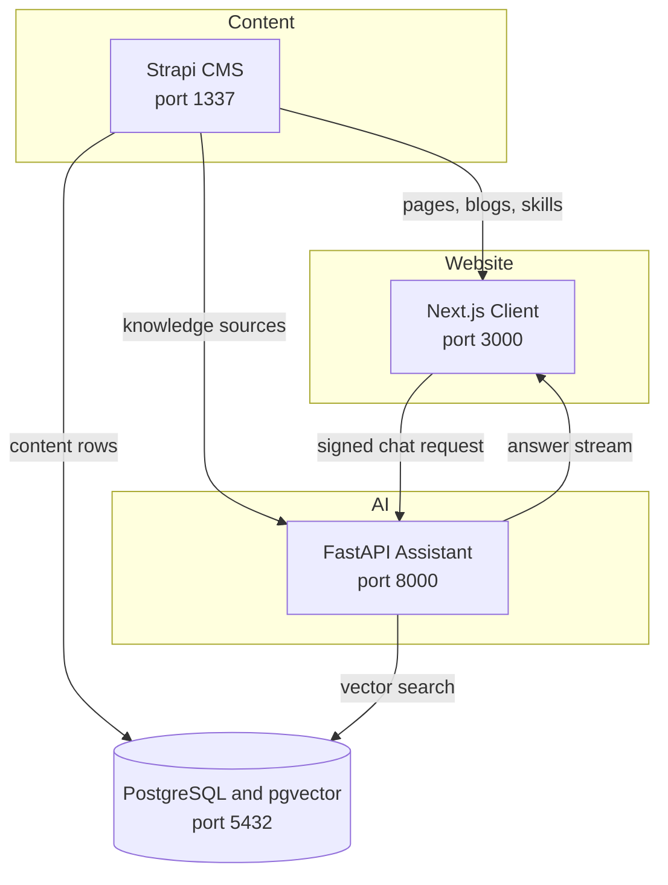

# Documentation

These guides explain how each part of the portfolio website works. Start with the [main README](../README.md) if you only want to run the project.

## Guides

| Guide | What it covers |
| --- | --- |
| [Client](CLIENT.md) | How the Next.js website builds pages from CMS content, the three registries, caching and the build |
| [CMS](CMS.md) | The Strapi content model and the custom Portfolio plugin |
| [Assistant](ASSISTANT.md) | Request signing, the knowledge sync, and how a chat answer is produced |

## The big picture

Three ideas hold the project together.

**Content drives the layout.** The client never hard codes a page. It receives a list of blocks from Strapi and looks each one up in a registry to find the React component that renders it.

**The CMS is the only source of truth.** Page content, section order, model choices and even the system prompts for the AI live in Strapi. Changing behaviour usually means editing content, not code.

**Every service call is signed.** The client and the CMS both talk to the assistant using an HMAC signature with a shared secret, a timestamp and a one time nonce, so the assistant cannot be called by anyone else.
